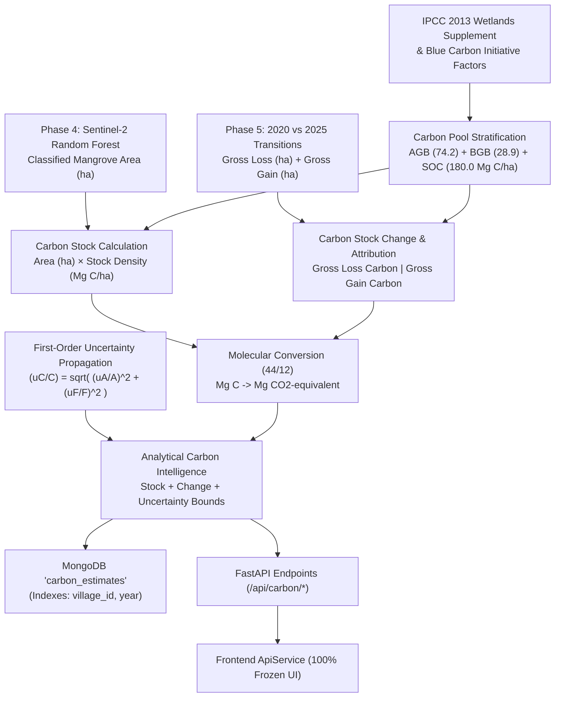

# Blue Carbon Estimation & Uncertainty Methodology

## 1. Executive Summary & Scientific Principles

**Phase 6** implements a model-based **Blue Carbon Estimation and Multi-Temporal Accounting Engine** for the Indian Sundarbans mangrove ecosystem.

---

## 2. Why Satellite Imagery Does Not Directly Measure Carbon

> [!IMPORTANT]
> **Optical satellites (such as Sentinel-2 MSI) measure Bottom-Of-Atmosphere spectral reflectance across visible, near-infrared, and shortwave-infrared wavelengths. They do not measure carbon mass directly.**

1. **Surface Canopy Proxy**: Multi-spectral vegetation indices ($\text{NDVI}$, $\text{NDWI}$, red-edge bands) delineate tree canopy crown cover and photosynthetic vigor.
2. **Subsurface & Soil Reservoirs**: In mangrove blue-carbon ecosystems, over $60\%$ of total organic carbon resides underground in waterlogged, anaerobic estuarine sediment depths ($0\text{–}1\text{m}$) and root networks ($BGB$). These cannot be measured from orbit.
3. **Activity Data Multiplier**: Satellite mapping provides the **Activity Data** (monitored surface area in hectares); peer-reviewed allometric literature and IPCC default tables provide the **Emission / Carbon Density Factors** ($\text{Mg C / ha}$).

---

## 3. Stratified Carbon Pools

In accordance with the **IPCC 2013 Wetlands Supplement (Chapter 4: Coastal Wetlands)** and the **Blue Carbon Initiative Coastal Blue Carbon Manual (Howard et al. 2014)**, carbon reservoirs are stratified into discrete pools:

| Carbon Pool | Parameter | Value | Unit | Source Citation | Tier | Share of Total |
| :--- | :---: | :---: | :---: | :--- | :---: | :---: |
| **Aboveground Biomass (AGB)** | $C_{\text{AGB}}$ | **$74.2$** | $\text{Mg C / ha}$ | IPCC 2013 Wetlands Supplement (Table 4.3: Tropical wet mangroves) | Tier 1 | $26.2\%$ |
| **Belowground Biomass (BGB)** | $C_{\text{BGB}}$ | **$28.9$** | $\text{Mg C / ha}$ | IPCC 2013 Wetlands Supplement (Table 4.5: Root-to-shoot ratio $R=0.39$) | Tier 1 | $10.2\%$ |
| **Soil Organic Carbon (SOC 0–1m)** | $C_{\text{SOC}}$ | **$180.0$** | $\text{Mg C / ha}$ | IPCC 2013 Table 4.11 & Kauffman et al. 2011 (Estuarine mangrove soils) | Tier 1 | $63.6\%$ |
| **Total Carbon Density (Baseline)** | $C_{\text{Total}}$ | **$283.1$** | $\text{Mg C / ha}$ | Sum of primary biomass and sediment pools | Tier 1 | $100.0\%$ |
| *Dead Wood & Litter (Optional)* | $C_{\text{Litter}}$ | $8.5$ | $\text{Mg C / ha}$ | IPCC 2013 Table 4.7 (Excluded from primary baseline due to high variance) | Tier 1 | *(Excluded)* |

---

## 4. Methodological Tiers

- **Tier 1 (`Current Pilot Status: Tier 1 / indicative`)**:
  Combines satellite-classified activity areas with internationally recognized default IPCC/literature carbon density values.
- **Tier 2 (`Future Ecoregional Calibration`)**:
  Utilizes country- or ecoregion-specific allometric equations developed for the Sundarbans Biosphere Reserve (e.g. *Avicennia marina*, *Rhizophora mucronata* regional biomass curves).
- **Tier 3 (`Future Certified Ground Truth`)**:
  Requires destructive/non-destructive permanent forest inventory plots, GPS-tagged sediment core sample spectrometry, and bulk density laboratory analysis for carbon-credit issuance (e.g. Verra VM0033).

---

## 5. Mathematical Equations & Conversions

### 5.1 Carbon Stock Equation
For a monitored mangrove area $A$ (hectares):

$$\text{Carbon Stock}_{\text{pool}} (\text{Mg C}) = A \times \text{Factor}_{\text{pool}} (\text{Mg C / ha})$$

$$\text{Total Carbon Stock} (\text{Mg C}) = \sum_{p \in \{\text{AGB}, \text{BGB}, \text{SOC}\}} \text{Carbon Stock}_p$$

### 5.2 Molecular Stoichiometry Conversion ($\text{C} \to \text{CO}_2\text{e}$)
Based on the molecular weights of Carbon dioxide ($\text{CO}_2: 44.01\text{ g/mol}$) and elemental Carbon ($\text{C}: 12.011\text{ g/mol}$):

$$\text{Stock}_{\text{CO}_2\text{e}} (\text{Mg }\text{CO}_2\text{e}) = \text{Total Carbon Stock} (\text{Mg C}) \times \left( \frac{44}{12} \right) \approx \text{Stock} \times 3.6667$$

### 5.3 Multi-Temporal Stock Change (2020 $\to$ 2025)
$$\Delta \text{Carbon} (\text{Mg C}) = \text{Carbon Stock}_{2025} - \text{Carbon Stock}_{2020}$$

$$\Delta \text{CO}_2\text{e} (\text{Mg }\text{CO}_2\text{e}) = \Delta \text{Carbon} \times \left( \frac{44}{12} \right)$$

$$\text{Gross Carbon Loss} (\text{Mg C}) = \text{Mangrove Loss Area (ha)} \times C_{\text{Total}} (\text{Mg C / ha})$$

$$\text{Gross Carbon Gain} (\text{Mg C}) = \text{Mangrove Gain Area (ha)} \times C_{\text{Total}} (\text{Mg C / ha})$$

$$\text{Annualized Stock Change Indicator} (\text{Mg C / yr}) = \frac{\Delta \text{Carbon}}{2025 - 2020}$$

> [!NOTE]
> **Stock Change vs. Sequestration Rate**:
> An annualized stock change indicator is an analytical interpolation between multi-year satellite observation dates. It does **not** represent continuous direct eddy-covariance or sediment accretion flux measurements.

---

## 6. Sector Baseline Estimates (Gosaba & Satjelia)

### 6.1 Gosaba Sector ($1,245.0\text{ ha}$ Total Area)

- **2020 Baseline ($750.60\text{ ha}$ Mangrove)**:
  - Total Carbon Stock: **$212,494.86\text{ Mg C}$**
  - Total $\text{CO}_2\text{e}$: **$779,147.82\text{ Mg }\text{CO}_2\text{e}$**
  - AGB Carbon ($26.2\%$): $55,694.52\text{ Mg C}$
  - BGB Carbon ($10.2\%$): $21,692.34\text{ Mg C}$
  - SOC Carbon ($63.6\%$): $135,108.00\text{ Mg C}$
- **2025 Observed ($775.60\text{ ha}$ Mangrove)**:
  - Total Carbon Stock: **$219,572.36\text{ Mg C}$**
  - Total $\text{CO}_2\text{e}$: **$805,098.65\text{ Mg }\text{CO}_2\text{e}$**
- **Net Stock Change ($2020 \to 2025$)**:
  - Net Carbon Delta: **$+7,077.50\text{ Mg C}$** ($+3.33\%$)
  - Net $\text{CO}_2\text{e}$ Delta: **$+25,950.83\text{ Mg }\text{CO}_2\text{e}$**
  - Gross Carbon Loss (Erosion & Aquaculture): $2,717.76\text{ Mg C}$ ($9.60\text{ ha}$)
  - Gross Carbon Gain (Colonization & Restoration): $9,795.26\text{ Mg C}$ ($34.60\text{ ha}$)
  - Annualized Stock Change: **$+1,415.50\text{ Mg C / yr}$** ($+5,190.17\text{ Mg }\text{CO}_2\text{e / yr}$)

### 6.2 Satjelia Sector ($980.0\text{ ha}$ Total Area)

- **2020 Baseline ($554.00\text{ ha}$ Mangrove)**:
  - Total Carbon Stock: **$156,837.40\text{ Mg C}$** ($575,070.47\text{ Mg }\text{CO}_2\text{e}$)
- **2025 Observed ($569.40\text{ ha}$ Mangrove)**:
  - Total Carbon Stock: **$161,197.14\text{ Mg C}$** ($591,056.18\text{ Mg }\text{CO}_2\text{e}$)
- **Net Stock Change ($2020 \to 2025$)**:
  - Net Carbon Delta: **$+4,359.74\text{ Mg C}$** ($+2.78\%$)
  - Net $\text{CO}_2\text{e}$ Delta: **$+15,985.71\text{ Mg }\text{CO}_2\text{e}$**
  - Gross Carbon Loss: $1,811.84\text{ Mg C}$ ($6.40\text{ ha}$)
  - Gross Carbon Gain: $6,171.58\text{ Mg C}$ ($21.80\text{ ha}$)

---

## 7. Uncertainty Methodology & Error Propagation

Uncertainty is evaluated using **first-order Gaussian error propagation** assuming statistical independence between satellite area mapping and allometric biomass factor variance:

$$\frac{u_C}{C} = \sqrt{ \left(\frac{u_A}{A}\right)^2 + \left(\frac{u_F}{F}\right)^2 }$$

- **Area Uncertainty ($u_A / A$)**: $\pm 3.5\%$ (Sentinel-2 MSI $20\text{m}$ border pixel classification uncertainty).
- **Factor Uncertainty ($u_F / F$)**: $\pm 18.0\%$ (IPCC Tier-1 Indo-Pacific biomass factor distribution).
- **Combined Relative Uncertainty**:
  $$\frac{u_C}{C} = \sqrt{(0.035)^2 + (0.180)^2} = \sqrt{0.001225 + 0.0324} \approx \pm 18.34\%$$
- **Gosaba 2025 Bounds ($85\%$ Confidence Interval)**:
  - Median: $219,572.36\text{ Mg C}$
  - Margin of Error: $\pm 40,269.53\text{ Mg C}$
  - Carbon Range: $[179,302.83\text{ Mg C},\, 259,841.89\text{ Mg C}]$

---

## 8. Indicative Voluntary Market Valuation Model

The economic valuation module applies an illustrative reference carbon price:

$$\text{Indicative Valuation (USD)} = \text{Total }\text{CO}_2\text{e (Mg)} \times \text{Reference Price (USD / Mg }\text{CO}_2\text{e)}$$

- **Benchmark Price**: $\$12.00\text{ USD / Mg }\text{CO}_2\text{e}$ (Voluntary Blue Carbon Market Benchmark).
- **Gosaba 2025 Indicative Valuation**: $\approx \$9,661,184\text{ USD}$.
- **Net Stock Growth Valuation ($2020 \to 2025$)**: $\approx \$311,410\text{ USD}$.

---

## 9. Critical Disclaimers & Limitations

> [!CAUTION]
> ### Certified Carbon Crediting Disclaimer
> 1. **No Carbon Credit Issuance**: This analytical model produces indicative estimations for regional environmental planning and deltaic monitoring. It does **not** constitute an issuance, minting, or listing of certified carbon credits (e.g. Verified Carbon Units / Plan Vivo Certificates).
> 2. **Additionality & Permanence**: Regulatory carbon credit registries require proof of financial additionality, legal land tenure title, baseline scenario modeling, and 30-to-100-year permanence buffers.
> 3. **Leakage & Buffer Pools**: Physical mangrove conservation in one sector can inadvertently displace aquaculture pressure to adjacent non-monitored creeks; this project does not certify project-boundary leakage buffers.
> 4. **No Financial Market Entitlement**: Output figures confer no legal entitlement to financial revenue, commercial carbon offsets, or regulatory compliance trading.
