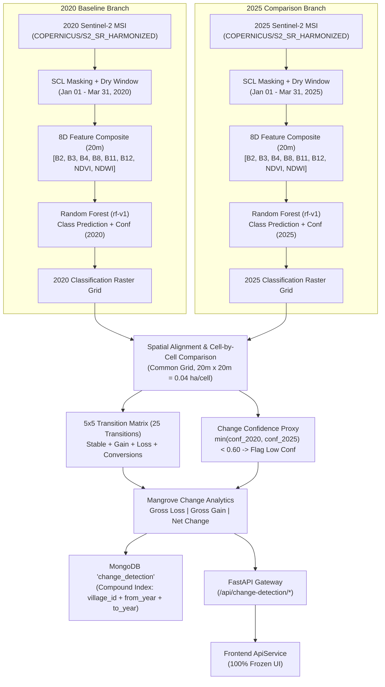

# Multi-Temporal Land-Cover Change Detection (2020 vs 2025)

## 1. Executive Summary & Architecture

**Phase 5** implements a cell-by-cell post-classification **Land-Cover Change Detection Engine** for the Sundarban delta comparing independent Sentinel-2 Level-2A classifications between **2020 (Baseline)** and **2025 (Observed)**.



---

## 2. Authoritative Land-Cover Classes & Taxonomic Taxonomy

The change detection pipeline operates strictly over the 5 discrete land-cover classes standardized in Phase 4:

| Class ID | Class Name | Hex Color | Role in Change Detection |
| :---: | :--- | :---: | :--- |
| **`0`** | **Mangrove** | `#16845f` | Primary conservation target; tracked for gross loss, gross gain, and stable core canopy. |
| **`1`** | **Water** | `#3896d8` | Estuarine river channels & tidal creeks; tracks riverbank erosion and mudflat submergence. |
| **`2`** | **Aquaculture** | `#f05d57` | Commercial brackish shrimp ponds (*bheri*); primary driver of anthropogenic mangrove loss. |
| **`3`** | **Bare Land** | `#b98d64` | Intertidal mudflats and earthen dykes; primary seedbed for pioneer mangrove colonization. |
| **`4`** | **Other Vegetation** | `#9acb55` | Village agroforests (coconut, betel palm); terrestrial vegetation buffer. |

---

## 3. Temporal Consistency & Seasonal Normalization

To isolate long-term ecological transitions from seasonal phenology and tidal noise, identical processing windows are enforced across both years:

- **Baseline Observation Window**: `2020-01-01` $\to$ `2020-03-31`
- **Comparison Observation Window**: `2025-01-01` $\to$ `2025-03-31`
- **Sensor Collection**: `COPERNICUS/S2_SR_HARMONIZED` (Level-2A Bottom-Of-Atmosphere reflectance).
- **Cloud/Shadow Masking**: Sentinel-2 Scene Classification Layer (SCL classes 3, 8, 9, 10, 11) + QA60 bitmask.
- **Composite Aggregation**: Pixel-wise temporal median composite across cloud-free acquisitions.

> [!IMPORTANT]
> Comparing dry-season composites (January–March) minimizes atmospheric moisture interference and deciduous canopy variance. Equivalent seasonal windows significantly reduce, but do not fully eliminate, tidal stage differences during satellite overpasses.

---

## 4. Multi-Temporal Model & Feature Consistency

Both 2020 and 2025 multi-spectral feature composites are evaluated using the **same trained Random Forest model artifact**:

- **Model Identifier**: `RandomForestClassifier` (`modelVersion: "rf-v1"`)
- **Feature Schema**: `sentinel2-v1` ($8$ dimensions: $[B2, B3, B4, B8, B11, B12, \text{NDVI}, \text{NDWI}]$)
- **Hyperparameters**: `n_estimators=200`, `criterion="gini"`, `class_weight="balanced"`, `random_state=42`.

If input classifications are detected with mismatched model versions or feature schemas, the service raises an `IncompatibleModelVersionError` to prevent spurious change artifacts.

---

## 5. Spatial Alignment & Resolution Standards

1. **Common Coordinate Reference System**: `EPSG:4326 (WGS84)`.
2. **Spatial Resolution**: Uniform $20\text{ m} \times 20\text{ m}$ ground sample distance.
3. **Unit Cell Area**:
   $$\text{Cell Area} = 20\text{ m} \times 20\text{ m} = 400\text{ m}^2 = 0.04\text{ ha}$$
4. **Spatial Coverage Validation**: Total cell counts between baseline and comparison grids must match bit-for-bit. Any discrepancy raises a `SpatialCoverageMismatchError`.

---

## 6. Authoritative 5×5 Transition Matrix (25 Transitions)

The complete transition matrix accounts for all $5 \times 5 = 25$ class-to-class trajectories:

```
                          2025 Destination Class
                 Mangrove   Water   Aquaculture   Bare Land   Other Veg
2020 Source Class
Mangrove       :   (0->0)   (0->1)     (0->2)       (0->3)      (0->4)
Water          :   (1->0)   (1->1)     (1->2)       (1->3)      (1->4)
Aquaculture    :   (2->0)   (2->1)     (2->2)       (2->3)      (2->4)
Bare Land      :   (3->0)   (3->1)     (3->2)       (3->3)      (3->4)
Other Veg      :   (4->0)   (4->1)     (4->2)       (4->3)      (4->4)
```

### Transition Categories:
- **`STABLE`**: Diagonal cells ($i = j$).
- **`MANGROVE_LOSS`**: Mangrove converting to any other class ($0 \to 1, 2, 3, 4$).
- **`MANGROVE_GAIN`**: Any non-mangrove class converting to mangrove ($1, 2, 3, 4 \to 0$).
- **`CLASS_CONVERSION`**: Conversions between non-mangrove classes ($i \ne 0 \land j \ne 0 \land i \ne j$).
- **`LOW_CONFIDENCE_CHANGE`**: Transitions where the change confidence proxy falls below the threshold ($< 0.60$).

---

## 7. Sector Baselines & Quantified Transitions (2020 $\to$ 2025)

### 7.1 Gosaba Sector ($1,245.0\text{ ha}$, $31,125\text{ cells}$)

- **2020 Mangrove Area**: $750.60\text{ ha}$ ($18,765\text{ cells}$, $60.29\%$)
- **2025 Mangrove Area**: $775.60\text{ ha}$ ($19,390\text{ cells}$, $62.30\%$)
- **Stable Mangrove Canopy**: $741.00\text{ ha}$ ($18,525\text{ cells}$)
- **Gross Mangrove Loss**: **$9.60\text{ ha}$** ($240\text{ cells}$)
  - Loss to Estuarine Water (Erosion): $5.80\text{ ha}$ ($145\text{ cells}$)
  - Loss to Shrimp Aquaculture (Encroachment): $3.80\text{ ha}$ ($95\text{ cells}$)
  - Loss to Bare Land / Mudflat: $0.00\text{ ha}$
  - Loss to Other Vegetation: $0.00\text{ ha}$
- **Gross Mangrove Gain**: **$34.60\text{ ha}$** ($865\text{ cells}$)
  - Gain from Water (Colonization): $18.20\text{ ha}$ ($455\text{ cells}$)
  - Gain from Aquaculture (Pond Restoration): $4.00\text{ ha}$ ($100\text{ cells}$)
  - Gain from Bare Land (Pioneer Recruitment): $12.40\text{ ha}$ ($310\text{ cells}$)
  - Gain from Other Vegetation: $0.00\text{ ha}$
- **Net Mangrove Change**: **$+25.00\text{ ha}$** ($+3.33\%$ expansion)

### 7.2 Satjelia Sector ($980.0\text{ ha}$, $24,500\text{ cells}$)

- **2020 Mangrove Area**: $554.00\text{ ha}$ ($13,850\text{ cells}$, $56.53\%$)
- **2025 Mangrove Area**: $569.40\text{ ha}$ ($14,235\text{ cells}$, $58.10\%$)
- **Stable Mangrove Canopy**: $547.60\text{ ha}$ ($13,690\text{ cells}$)
- **Gross Mangrove Loss**: **$6.40\text{ ha}$** ($160\text{ cells}$)
  - Loss to Estuarine Water: $4.20\text{ ha}$ ($105\text{ cells}$)
  - Loss to Shrimp Aquaculture: $2.20\text{ ha}$ ($55\text{ cells}$)
- **Gross Mangrove Gain**: **$21.80\text{ ha}$** ($545\text{ cells}$)
  - Gain from Water: $12.50\text{ ha}$ ($312\text{ cells}$)
  - Gain from Aquaculture: $2.00\text{ ha}$ ($50\text{ cells}$)
  - Gain from Bare Land: $7.30\text{ ha}$ ($183\text{ cells}$)
- **Net Mangrove Change**: **$+15.40\text{ ha}$** ($+2.78\%$ expansion)

---

## 8. Conservative Confidence Proxy & Low-Confidence Filtering

For every aligned spatial cell $k$:

$$\text{Confidence}_{\text{change}}(k) = \min\left( \text{Confidence}_{2020}(k),\, \text{Confidence}_{2025}(k) \right)$$

- **Threshold**: $\tau = 0.60$
- **Flagging Rule**: If $\text{fromClass} \ne \text{toClass}$ and $\text{Confidence}_{\text{change}} < 0.60$, the transition is flagged as `isLowConfidence = true`.
- **Filtering Parameter**: `include_low_confidence=false` enables strict change filtering to suppress multi-temporal classification noise at muddy shoreline boundaries.

---

## 9. Scientific Limitations & Boundaries

1. **Multi-Temporal Error Propagation**: Post-classification change detection compounds errors from both independent classifications:
   $$\text{Accuracy}_{\text{change}} \approx \text{Accuracy}_{2020} \times \text{Accuracy}_{2025}$$
2. **Detected Change vs. Confirmed Ecological Change**: Model-detected transitions represent spectral shifts in satellite composites. Ground-truth field surveys and GPS verification are required for legally binding carbon or conservation auditing.
3. **Tidal Inundation Artifacts**: Tidal height variations between 2020 and 2025 acquisitions can shift the apparent boundary between open water, intertidal mudflats, and low-stature pneumatophore root zones.
4. **No Carbon or Economic Accounting**: Carbon stock quantification, credit estimation, and economic valuation are strictly reserved for **Phase 6**.
