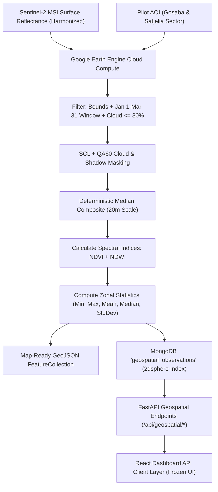

# Geospatial & Satellite Data Pipeline — Google Earth Engine + Sentinel-2

## 1. Executive Summary & Core Objective

The **Sundarban Blue Carbon Geospatial Pipeline (Phase 3)** establishes a reproducible, scientifically grounded satellite telemetry ingestion system for coastal mangrove monitoring in the Indian Sundarbans.



---

## 2. Satellite Sensor & Collection Specifications

### 2.1 Sensor Overview
The pipeline ingests multi-spectral optical telemetry from the **European Space Agency (ESA) Copernicus Sentinel-2 Multi-Spectral Instrument (MSI)**.

- **Orbit**: Sun-synchronous at 786 km altitude.
- **Revisit Time**: 5 days with twin satellites (Sentinel-2A & Sentinel-2B).
- **Radiometric Resolution**: 12-bit native digitized to 16-bit surface reflectance (scaled by 10,000).

### 2.2 Google Earth Engine Collection ID
- **Collection ID**: `COPERNICUS/S2_SR_HARMONIZED`
- **Processing Level**: Level-2A Surface Reflectance (Bottom-of-Atmosphere, atmospherically corrected using Sen2Cor).
- **Harmonized Baseline**: Guarantees radiometric consistency across processing baselines before and after January 2022 (correcting the +1000 DN offset introduced in baseline 04.00).

---

## 3. Required Spectral Bands & Resolutions

The Phase 3 analytical pipeline extracts six critical spectral bands covering the Visible, Near-Infrared (VNIR), and Shortwave-Infrared (SWIR) domains:

| Band | Name | Central Wavelength ($\lambda$) | Native Resolution | Analytical Purpose in Mangrove Ecosystems |
| :--- | :--- | :--- | :--- | :--- |
| **B2** | Blue | $490\text{ nm}$ | $10\text{ m}$ | Coastal water depth penetration & atmospheric scattering |
| **B3** | Green | $560\text{ nm}$ | $10\text{ m}$ | Peak vegetation green reflectance & NDWI computation |
| **B4** | Red | $665\text{ nm}$ | $10\text{ m}$ | In-vivo chlorophyll-a absorption & NDVI computation |
| **B8** | NIR | $842\text{ nm}$ | $10\text{ m}$ | Mangrove leaf mesophyll cellular scattering & biomass proxy |
| **B11** | SWIR-1 | $1610\text{ nm}$ | $20\text{ m}$ | Canopy moisture absorption & tidal mudflat separation |
| **B12** | SWIR-2 | $2190\text{ nm}$ | $20\text{ m}$ | Soil/sediment background differentiation & embankment tracking |

> [!NOTE]
> Bands B11 and B12 have a native resolution of 20 meters, while B2, B3, B4, and B8 have a native resolution of 10 meters. For zonal statistic aggregation and future multi-band stack classification (Phase 4), Earth Engine resamples bands to a uniform 20-meter analytical grid using bilinear interpolation.

---

## 4. Area of Interest (AOI) & Coordinate Ordering

### 4.1 Pilot AOI: Gosaba–Satjelia Sector
- **File**: `backend/data/aoi/sundarban_pilot.geojson`
- **CRS**: `EPSG:4326 (WGS84)`
- **Spatial Bounds**: Longitude $[88.775^\circ\text{E}, 88.920^\circ\text{E}]$, Latitude $[22.120^\circ\text{N}, 22.250^\circ\text{N}]$.
- **Approximate Area**: $\approx 2,225\text{ hectares}$.

### 4.2 Strict GeoJSON Coordinate Standard
GeoJSON coordinates strictly follow the standard:
$$\mathbf{[longitude, latitude]}$$
- Longitude $\in [-180.0, 180.0]$
- Latitude $\in [-90.0, 90.0]$

> [!WARNING]
> Inverted coordinates $[latitude, longitude]$ are rejected during validation by `app.geospatial.aoi.validate_coordinates()`.

---

## 5. Seasonal Analytical Window & Tidal Considerations

### 5.1 Configured Seasonal Period
- **Default Window**: **January 1 to March 31** (Post-Monsoon / Dry Winter Window).
- **Multi-Year Baseline**: 2020 vs 2025.

### 5.2 Scientific Rationale for Seasonal Selection
1. **Cloud Minimality**: The Bay of Bengal monsoon (June–September) causes near-continuous 100% cloud cover. The dry window maximizes clear-sky scene availability.
2. **Phenological Stability**: Mangrove species (*Avicennia marina*, *Rhizophora mucronata*, *Ceriops decandra*) exhibit stable leaf area index during early dry season without deciduous canopy shedding.
3. **Multi-Year Comparability**: Using strictly identical seasonal calendar windows across comparison years (2020 vs 2025) avoids false-positive change detection caused by seasonal tide/sun angle fluctuations.

---

## 6. Cloud & Shadow Masking Pipeline

### 6.1 Scene Classification Layer (SCL) Masking
Sentinel-2 Level-2A includes an automated scene classification layer (SCL) at 20m resolution. The pipeline masks out unreliable pixels:

- **Masked Pixel Classes**:
  - Class 3: Cloud shadow
  - Class 8: Cloud medium probability
  - Class 9: Cloud high probability
  - Class 10: Thin cirrus
  - Class 11: Snow / Ice
- **Preserved Pixel Classes**:
  - Class 4: Vegetation (mangrove forests, plantations)
  - Class 5: Non-vegetated (bare soil, mudflats, embankments)
  - Class 6: Water (estuaries, tidal creeks, rivers)
  - Class 2: Dark area pixels
  - Class 7: Unclassified

### 6.2 QA60 Bitmasking
When present, QA60 cloud bitmasks are combined with SCL:
- Bit 10 ($1024$): Opaque cloud bit $\to 0$ (clear)
- Bit 11 ($2048$): Cirrus cloud bit $\to 0$ (clear)

### 6.3 Deterministic Median Composite
After masking clouds on each individual acquisition within the seasonal window, a **pixel-wise median reducer** (`collection.median()`) is applied across all clear observations:
$$\text{Pixel}_{\text{composite}}(x, y) = \text{median}\left(\{\text{Pixel}_i(x, y) \mid i \in \text{clear scenes}\}\right)$$

---

## 7. Spectral Indices Formulations

### 7.1 Normalized Difference Vegetation Index (NDVI)
$$\text{NDVI} = \frac{\text{NIR} - \text{RED}}{\text{NIR} + \text{RED}} = \frac{B8 - B4}{B8 + B4}$$
- **Valid Range**: $[-1.0, 1.0]$
- **Typical Mangrove Canopy Values**: $+0.60 \text{ to } +0.88$
- **Water / Silt Values**: $-0.40 \text{ to } -0.10$
- **Role**: Measures photosynthetic activity, canopy density, and chlorophyll concentration.

### 7.2 Normalized Difference Water Index (NDWI - McFeeters 1996)
$$\text{NDWI} = \frac{\text{GREEN} - \text{NIR}}{\text{GREEN} + \text{NIR}} = \frac{B3 - B8}{B3 + B8}$$
- **Valid Range**: $[-1.0, 1.0]$
- **Water / Estuarine Channels**: $+0.20 \text{ to } +0.70$
- **Dense Mangrove Vegetation**: $-0.80 \text{ to } -0.30$
- **Role**: Delineates water-land boundaries, estuarine channels, and intertidal aquaculture ponds.

> [!IMPORTANT]
> This pipeline implements the authoritative **McFeeters (1996)** NDWI formulation ($\text{Green} - \text{NIR}$). This is distinct from Gao (1996) NDWI ($\text{NIR} - \text{SWIR}$) and Xu (2006) Modified NDWI (MNDWI, $\text{Green} - \text{SWIR}$).

---

## 8. Zonal Statistics Extraction

For each spectral band and index over the pilot AOI, five summary zonal statistics are calculated:

1. **$\text{Min}$**: Minimum valid pixel value within the AOI.
2. **$\text{Max}$**: Maximum valid pixel value within the AOI.
3. **$\text{Mean}$**: Spatial arithmetic average ($\mu$).
4. **$\text{Median}$**: 50th percentile distribution value.
5. **$\text{StdDev}$**: Standard deviation ($\sigma$), representing spatial variance and heterogeneity.

---

## 9. Data Storage & MongoDB Architecture

Processed observations are stored in MongoDB collection `geospatial_observations`:

```json
{
  "village_id": "gosaba",
  "village_name": "Gosaba",
  "year": 2025,
  "source": "Sentinel-2",
  "platform": "Google Earth Engine",
  "collection": "COPERNICUS/S2_SR_HARMONIZED",
  "dataSource": "sentinel2_gee",
  "isRealData": true,
  "geometry": {
    "type": "Polygon",
    "coordinates": [...]
  },
  "bands": {
    "B2": {"min": 180.0, "max": 1420.0, "mean": 482.5, "median": 430.0, "std_dev": 125.4},
    "B3": {"min": 240.0, "max": 1680.0, "mean": 612.8, "median": 580.0, "std_dev": 142.1},
    "B4": {"min": 190.0, "max": 1850.0, "mean": 456.2, "median": 395.0, "std_dev": 168.7},
    "B8": {"min": 320.0, "max": 3840.0, "mean": 2480.6, "median": 2650.0, "std_dev": 620.3},
    "B11": {"min": 210.0, "max": 2450.0, "mean": 1120.4, "median": 1050.0, "std_dev": 310.8},
    "B12": {"min": 150.0, "max": 1980.0, "mean": 640.2, "median": 580.0, "std_dev": 215.6}
  },
  "indices": {
    "NDVI": {"min": -0.28, "max": 0.88, "mean": 0.68, "median": 0.74, "std_dev": 0.18},
    "NDWI": {"min": -0.82, "max": 0.65, "mean": -0.38, "median": -0.44, "std_dev": 0.24}
  },
  "processing": {
    "collectionId": "COPERNICUS/S2_SR_HARMONIZED",
    "startDate": "2025-01-01",
    "endDate": "2025-03-31",
    "imageCount": 14,
    "cloudThreshold": 30,
    "compositeMethod": "median",
    "bands": ["B2", "B3", "B4", "B8", "B11", "B12"],
    "indices": ["NDVI", "NDWI"],
    "resolutionMeters": 20
  }
}
```

### Spatial Indexes
- `db.geospatial_observations.create_index([("geometry", "2dsphere")])`
- `db.geospatial_observations.create_index([("village_id", 1), ("year", 1)], unique=True)`

---

## 10. API Endpoints

All endpoints are registered under `/api/geospatial`:

| Endpoint | Method | Response Model | Description |
| :--- | :--- | :--- | :--- |
| `/api/geospatial/status` | `GET` | `GeospatialStatusResponse` | GEE connectivity status, configuration, collection ID, and seasonal window. |
| `/api/geospatial/observations` | `GET` | `SentinelObservation` | Full multi-spectral observation and band zonal statistics for a sector and year. |
| `/api/geospatial/indices` | `GET` | `GeospatialIndicesResponse` | Detailed NDVI and NDWI index statistics, formulas, and interpretations. |
| `/api/geospatial/preview` | `GET` | `GeospatialPreviewResponse` | Map-ready GeoJSON FeatureCollection payload for Leaflet overlays. |

---

## 11. Scientific Limitations & Boundaries

1. **NDVI is an Indicator, NOT Direct Carbon**: High NDVI indicates photosynthetic vigor and chlorophyll density, but does not provide direct dry weight biomass or soil organic carbon (SOC) depth profiles.
2. **Semi-Diurnal Tidal Inundation**: The Sundarbans delta experiences 3–5 meter semi-diurnal tides. Satellite imagery acquired at high tide shows submerged pneumatophores and lower NIR reflectance; imagery acquired at low tide shows exposed mudflats. Multi-scene median compositing mitigates single-tide anomalies.
3. **Cloud Shadow Artifacts**: Dense tropical cumulus clouds cast shadows that can simulate low-reflectance water bodies or disturbed forest if unmasked. SCL shadow masking minimizes this artifact.
4. **No Classification in Phase 3**: Phase 3 is strictly the raw spectral and index data foundation. Random Forest land-cover classification is deferred to Phase 4.

---

## 12. Roadmap to Phase 4 (Machine Learning Classification)

Phase 4 will consume the clean 6-band composite ($B2, B3, B4, B8, B11, B12$) + $NDVI + NDWI$ feature stack generated in Phase 3 to train a supervised **Random Forest Land-Cover Classifier** with 5 classes:
1. Dense Mangrove Forest
2. Open Water / Estuarine Channels
3. Aquaculture / Shrimp Ponds
4. Intertidal Mudflats / Bare Land
5. Agriculture / Non-Mangrove Vegetation

---

## Random Forest mangrove pipeline (GEE-side)

Code: `backend/app/pipeline/` · Runner: `backend/scripts/run_gee_pipeline.py` · Tests: `backend/tests/test_pipeline.py`

The classifier is trained and run **inside Earth Engine**; Gemini is never used for classification.

```
CGMD-AFCC30 (30 m, 1985–2023)        Sentinel-2 SR (10 m, 2019–)
        │ labels                              │ features (B2 B3 B4 B8 B11 B12 NDVI NDWI)
        ▼                                     ▼
stable pixels 2019–2022 ──► stratified samples ──► smileRandomForest(200)
(never changed, edges eroded 30 m)                     │
                                                       ├─► 2023: confusion matrix vs CGMD 2023 (held out)
                                                       └─► 2019…2025: label + confidence per pixel
                                                                 │
                                          area per class (ha) ◄──┤
                                          gain / loss / uncertain (MMU 0.5 ha, conf ≥ 0.6)
                                                                 │
                                          data/pipeline_results/<village>_<modelVersion>.json
```

Key rules the code enforces:

- **Test year is never a training year** (`PipelineConfig.validate`).
- **Same sensor, same season, same model for every compared year.** CGMD's 1985–2018 series is context only, not compared pixel-to-pixel with Sentinel-2 output.
- **Model version** = hash of the training signature (years, samples, trees, seed, features, reference asset). Change any of them → new version → rerun all years.
- **Change filtering**: patches below the minimum mapping unit are dropped; change pixels with confidence < threshold in either year are reported as `uncertainHa`, not as gain/loss.

Running it (from `backend/`, with GEE credentials in `.env`):

```bash
python scripts/run_gee_pipeline.py --village gosaba --dry-run   # config + model version only
python scripts/run_gee_pipeline.py --village gosaba              # full run, saves JSON
python scripts/run_gee_pipeline.py --village gosaba --export projects/<proj>/assets/sbc  # also export rasters
```

Before the first real run, confirm the CGMD asset layout in the Code Editor and set `CGMD_ASSET_TYPE` / `CGMD_BAND_PATTERN` / `CGMD_MANGROVE_VALUE` accordingly. The reference map is binary (mangrove / not), so the pipeline is binary too; a 5-class model needs additional label sources (e.g. ESA WorldCover for water, hand-labelled aquaculture points).
