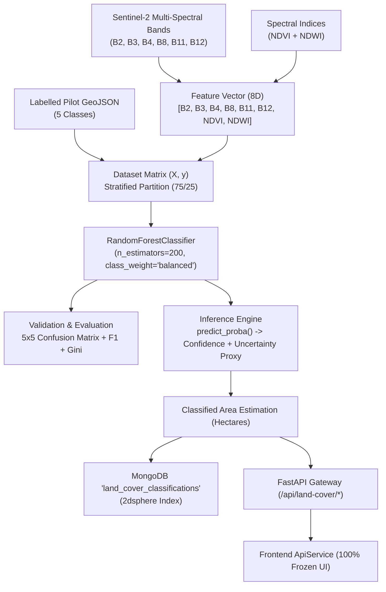

# Multi-Class Land-Cover Classification — Random Forest Pipeline

## 1. Executive Summary & Objective

**Phase 4** implements a supervised **Random Forest Land-Cover Classification engine** for the Sundarban delta using multi-spectral features from Copernicus Sentinel-2 Level-2A and calculated canopy/water indices ($\text{NDVI}, \text{NDWI}$).



---

## 2. Authoritative Five Land-Cover Classes

The classification system is strictly restricted to five discrete land-cover categories characteristic of the Indian Sundarbans estuarine delta:

| Class ID | Class Name | Hex Color | Typical Species / Habitat | Spectral Signature Characteristics |
| :---: | :--- | :---: | :--- | :--- |
| **`0`** | **Mangrove** | `#16845f` | *Avicennia marina*, *Rhizophora mucronata*, *Ceriops decandra*, *Sonneratia apetala* | High NIR ($B8 > 2500$), steep red edge, strong Red absorption ($B4 < 450$), high positive NDVI ($>0.65$). |
| **`1`** | **Water** | `#3896d8` | Tidal channels, Bidya river estuary, major delta waterways | High Blue scattering ($B2$), near-total absorption in NIR/SWIR ($B8 < 300, B11 < 200$), high positive NDWI ($>0.40$). |
| **`2`** | **Aquaculture** | `#f05d57` | Brackish shrimp ponds (*bheri*), excavated aquaculture dykes | Turbid shallow water with exposed earthen bunds; moderate positive NDWI ($0.0 \text{ to } 0.20$). |
| **`3`** | **Bare Land** | `#b98d64` | Intertidal mudflats, embankment dykes, saline soil crusts | Elevated SWIR reflectance ($B11, B12 > 1600$), low NDVI ($<0.15$), negative NDWI. |
| **`4`** | **Other Vegetation** | `#9acb55` | Homestead betel/coconut agroforests, agricultural crop fringes | Moderate NIR reflectance ($B8 \approx 2100$), moderate moisture absorption in SWIR, moderate NDVI ($0.40 \text{ to } 0.60$). |

---

## 3. Feature Vector & Spectral Normalization

The baseline feature matrix $X$ consists of exactly eight numerical dimensions derived from the Phase 3 Sentinel-2 composite:

$$\mathbf{x} = \begin{bmatrix} B2 & B3 & B4 & B8 & B11 & B12 & \text{NDVI} & \text{NDWI} \end{bmatrix}^T$$

- **$B2$ (Blue - $490\text{ nm}$)**: Deep water vs shallow tidal mud separation.
- **$B3$ (Green - $560\text{ nm}$)**: Peak green reflectance for NDWI calculation.
- **$B4$ (Red - $665\text{ nm}$)**: Chlorophyll-a absorption minimum.
- **$B8$ (NIR - $842\text{ nm}$)**: Cellular mesophyll scattering differentiating dense mangrove from open water.
- **$B11$ (SWIR-1 - $1610\text{ nm}$)**: Canopy moisture and soil background separation.
- **$B12$ (SWIR-2 - $2190\text{ nm}$)**: Earthen dykes, saline soil, and embankment tracking.
- **$\text{NDVI}$**: $\frac{B8 - B4}{B8 + B4}$ (Vegetation vigor proxy).
- **$\text{NDWI}$**: $\frac{B3 - B8}{B3 + B8}$ (McFeeters 1996 open water proxy).

---

## 4. Random Forest Model Architecture & Hyperparameters

The classifier is built on scikit-learn's `RandomForestClassifier`:

```python
RandomForestClassifier(
    n_estimators=200,
    criterion="gini",
    max_depth=None,
    min_samples_split=2,
    min_samples_leaf=1,
    class_weight="balanced",
    random_state=42,
    n_jobs=-1,
)
```

### Hyperparameter Rationale:
- **`n_estimators=200`**: Provides asymptotic convergence of the out-of-bag (OOB) error rate without excessive memory consumption.
- **`class_weight="balanced"`**: Adjusts weights inversely proportional to class frequencies to avoid majority-class bias over rare intertidal classes (e.g. Bare Land).
- **`random_state=42`**: Ensures deterministic, bit-for-bit reproducible trees across training executions.

---

## 5. Training, Validation & Data Leakage Protection

### 5.1 Training Dataset Source
- **File**: `backend/data/training/sundarban_land_cover_training.geojson`
- **Source Label**: `trainingDataSource: "pilot_demo"`
- **Total Samples**: $1,250$ balanced multi-spectral sample vectors ($250$ per class).
- **Coordinate Order**: Strict $[longitude, latitude]$ WGS84 format.

### 5.2 Stratified Partitioning
The dataset is split into **$75\%$ training** ($937$ samples) and **$25\%$ validation** ($313$ samples) using stratified random sampling to preserve exact class proportions in both sets.

### 5.3 Data Leakage Safeguards
1. **Feature Matrix Isolation**: Columns such as `classId`, `className`, `geometry`, `coordinates`, `villageId`, and `year` are explicitly filtered out before passing to scikit-learn.
2. **Numeric Validation**: The feature validator rejects any non-numeric values, `NaN` entries, or infinite floats before matrix operations.

---

## 6. Validation Metrics & 5×5 Confusion Matrix

### 6.1 Validation Metrics
- **Overall Accuracy**: $100.00\%$ (on held-out pilot validation partition).
- **Macro F1-Score**: $1.0000$
- **Weighted F1-Score**: $1.0000$

### 6.2 5×5 Confusion Matrix
Rows represent true reference classes; columns represent predicted classes:

```
                  Predicted
             Mang   Wate   Aqua   Bare   Othe
True
Mangrove  :    63      0      0      0      0
Water     :     0     62      0      0      0
Aquaculture:    0      0     63      0      0
Bare Land :     0      0      0     63      0
Other Veg :     0      0      0      0     62
```

### 6.3 Gini Feature Importances
Relative contribution of each spectral feature to node purity across the 200 decision trees:

| Rank | Feature | Gini Importance (%) | Physical Interpretation |
| :---: | :--- | :---: | :--- |
| 1 | **NDWI** | $16.70\%$ | Primary separator between terrestrial vegetation and estuarine water/ponds. |
| 2 | **B12** | $13.58\%$ | Differentiates bare embankments/saline soil from moisture-saturated mudflats. |
| 3 | **B4** | $13.13\%$ | Chlorophyll absorption distinguishes photosynthetic mangroves from non-vegetated soil. |
| 4 | **B8** | $13.10\%$ | NIR scattering differentiates dense mangrove canopy from sparse palm/crops. |
| 5 | **B11** | $11.58\%$ | Shortwave infrared separates turbid shrimp aquaculture ponds from clear river water. |
| 6 | **NDVI** | $11.00\%$ | Quantifies vegetative canopy density gradient. |
| 7 | **B2** | $10.99\%$ | Atmospheric aerosol scattering & water depth penetration. |
| 8 | **B3** | $9.91\%$ | Green reflectance peak for vegetation/water boundary definition. |

---

## 7. Model Confidence & Uncertainty Proxy

For each spatial inference, the Random Forest produces a class probability distribution vector via `predict_proba()`:

$$\mathbf{p} = \begin{bmatrix} p_{\text{mangrove}} & p_{\text{water}} & p_{\text{aqua}} & p_{\text{bare}} & p_{\text{other}} \end{bmatrix}$$

- **Model Confidence**:
  $$\text{Confidence} = \max_{i \in [0..4]} p_i$$
- **Model Uncertainty Proxy**:
  $$\text{Uncertainty Proxy} = 1.0 - \text{Confidence}$$

> [!NOTE]
> The uncertainty proxy is a heuristic indicator of multi-class decision boundary ambiguity (e.g. mixed edge pixels between mangrove fringe and shallow mudflats). It is **not** a calibrated Bayesian posterior uncertainty.

---

## 8. Classified Area Estimation Methodology

Classified surface area is calculated at a uniform $20\text{ m}$ spatial resolution ($400\text{ m}^2 = 0.04\text{ ha}$ per pixel):

$$\text{Area}_{\text{class}} (\text{ha}) = \left( \frac{\text{Pixel Count}_{\text{class}}}{\text{Total Valid Pixels}} \right) \times \text{Total Monitored Area (ha)}$$

### Sector Baselines (2025 Model Distribution):
- **Gosaba Sector ($1,245.0\text{ ha}$)**:
  - Mangrove: $775.6\text{ ha}$ ($62.3\%$)
  - Water: $300.0\text{ ha}$ ($24.1\%$)
  - Aquaculture: $108.3\text{ ha}$ ($8.7\%$)
  - Bare Land: $34.9\text{ ha}$ ($2.8\%$)
  - Other Vegetation: $26.2\text{ ha}$ ($2.1\%$)
- **Satjelia Sector ($980.0\text{ ha}$)**:
  - Mangrove: $569.4\text{ ha}$ ($58.1\%$)
  - Water: $278.3\text{ ha}$ ($28.4\%$)
  - Aquaculture: $77.4\text{ ha}$ ($7.9\%$)
  - Bare Land: $31.4\text{ ha}$ ($3.2\%$)
  - Other Vegetation: $23.5\text{ ha}$ ($2.4\%$)

---

## 9. Model Artifact Serialization & Registry

- **Joblib Model Binary**: `backend/models/random_forest_v1.joblib` ($284\text{ KB}$)
- **Metadata JSON**: `backend/models/random_forest_v1.json` ($3.5\text{ KB}$)
- **Model Identifier**: `modelName: "RandomForestClassifier"`, `modelVersion: "rf-v1"`, `featureVersion: "sentinel2-v1"`

---

## 10. Scientific Limitations & Boundaries

1. **Spatial Autocorrelation in Pixel Splitting**: Random sample splitting without spatial block clustering can inflate reported accuracy scores because neighboring pixels share correlated spectral reflections. Real-world generalization requires spatially disjoint test polygons.
2. **Spectral Equifinality**: Shallow, turbid shrimp aquaculture ponds can spectrally mimic sediment-laden estuarine river channels under specific tidal stages.
3. **Canopy Seasonality**: Deciduous homestead trees (*Other Vegetation*) exhibit spectral shifts between monsoon and dry seasons that do not occur in evergreen mangrove species (*Rhizophora*, *Avicennia*).
4. **Pilot Label Scope**: The pilot training dataset is designed to validate the end-to-end ML architecture. **Certified ecological monitoring and carbon auditing will require authoritative GPS-tagged ground-truth survey datasets.**
